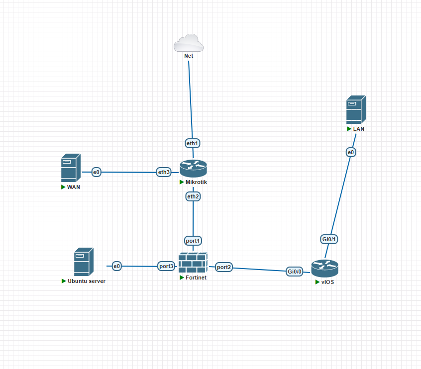
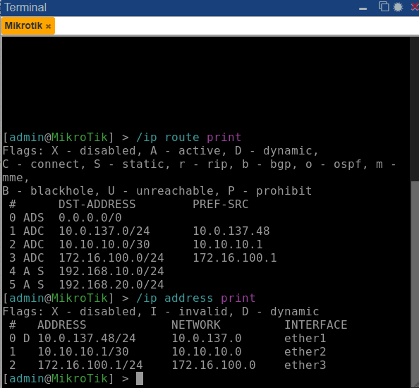
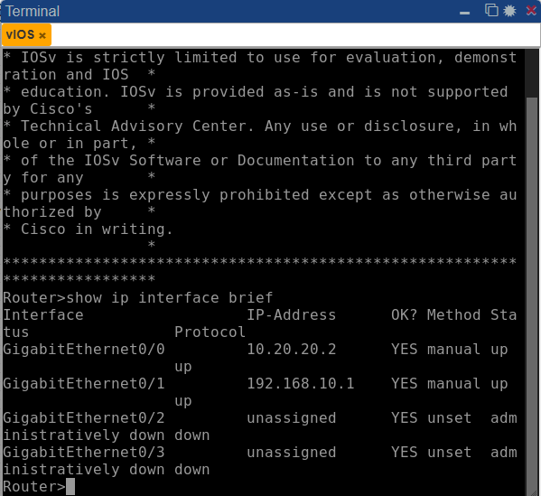
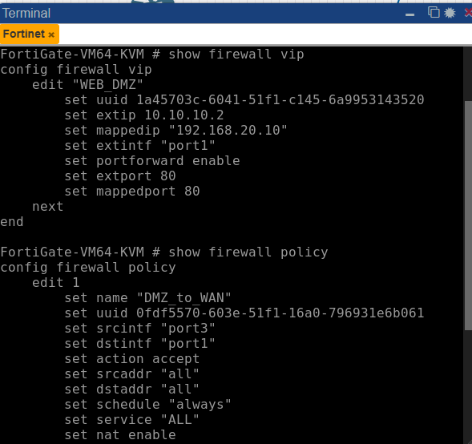
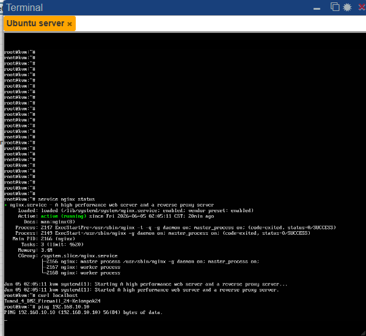
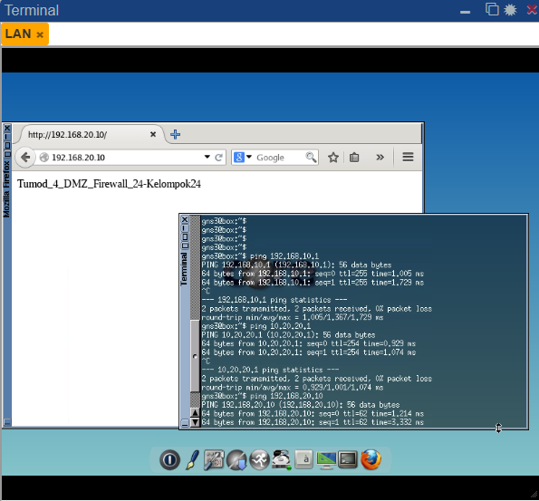
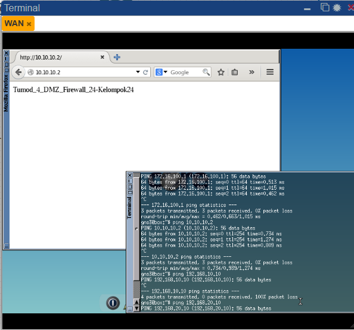

# Firewall & NAT - Modul 4

## Topologi Jaringan

Topologi jaringan terdiri dari MikroTik sebagai router ISP, FortiGate sebagai firewall utama, Cisco Router sebagai gateway jaringan LAN, Ubuntu Server sebagai web server pada zona DMZ, serta dua client yang mewakili jaringan LAN dan WAN.

---

## Tabel IP Address

| Perangkat | Interface | IP Address | Gateway | Keterangan |
|------------|------------|------------|------------|------------|
| MikroTik ISP | ether1 | DHCP Client | DHCP dari jaringan lab | Terhubung ke Cloud / jaringan lab |
| MikroTik ISP | ether2 | 10.10.10.1/30 | - | Terhubung ke FortiGate port1 |
| MikroTik ISP | ether3 | 172.16.100.1/24 | - | Gateway untuk Client WAN |
| FortiGate | port1 | 10.10.10.2/30 | 10.10.10.1 | Interface WAN |
| FortiGate | port2 | 10.20.20.1/30 | - | Interface INSIDE ke Cisco |
| FortiGate | port3 | 192.168.20.1/24 | - | Interface DMZ |
| Cisco Router | G0/0 | 10.20.20.2/30 | - | Terhubung ke FortiGate port2 |
| Cisco Router | G0/1 | 192.168.10.1/24 | - | Gateway LAN |
| Client LAN TinyCore Linux | eth0 | 192.168.10.10/24 | 192.168.10.1 | Client internal |
| Client WAN TinyCore Linux | eth0 | 172.16.100.10/24 | 172.16.100.1 | Client luar |
| Ubuntu Server DMZ | eth0 | 192.168.20.10/24 | 192.168.20.1 | Web Server DMZ |
---

# Konfigurasi Perangkat

## MikroTik ISP

MikroTik dikonfigurasi sebagai router ISP dengan DHCP Client, NAT Masquerade, dan Static Route menuju jaringan LAN dan DMZ.

---

## Cisco Router

Cisco Router digunakan sebagai gateway jaringan LAN.

---

## FortiGate

FortiGate berfungsi sebagai firewall utama yang menghubungkan jaringan WAN, LAN, dan DMZ. Selain itu dilakukan konfigurasi Firewall Policy dan Virtual IP (VIP).

---

## Ubuntu Server DMZ

Ubuntu Server digunakan sebagai web server pada zona DMZ menggunakan layanan Nginx.

---

# Hasil Pengujian

## Pengujian Client LAN

Pengujian dilakukan dengan melakukan ping ke Cisco Router, FortiGate, dan Ubuntu Server pada DMZ serta melakukan akses web server menggunakan alamat IP internal.

---

## Pengujian Client WAN

Pengujian dilakukan dengan melakukan ping ke MikroTik ISP dan FortiGate. Selanjutnya dilakukan pengujian akses web server melalui alamat Virtual IP FortiGate (10.10.10.2).

---

# Analisis

Pada praktikum ini dilakukan implementasi firewall dan NAT menggunakan MikroTik, FortiGate, Cisco Router, dan Ubuntu Server. MikroTik berfungsi sebagai router ISP yang menyediakan akses menuju jaringan luar, sedangkan FortiGate digunakan sebagai firewall utama yang mengatur lalu lintas jaringan antara WAN, LAN, dan DMZ.

Firewall Policy pada FortiGate digunakan untuk mengontrol akses antar segmen jaringan sehingga hanya lalu lintas yang diizinkan yang dapat melewati firewall. Selain itu, fitur Virtual IP (VIP) digunakan untuk melakukan port forwarding sehingga layanan web pada server DMZ dapat diakses dari jaringan WAN menggunakan alamat IP FortiGate.

Berdasarkan hasil pengujian yang telah dilakukan, client LAN dapat mengakses server DMZ secara langsung menggunakan alamat IP internal. Sementara itu, client WAN dapat mengakses layanan web melalui Virtual IP yang telah dikonfigurasi tanpa mengetahui alamat IP asli server DMZ.

---

# Kesimpulan

Berdasarkan hasil praktikum yang telah dilakukan, konfigurasi routing, firewall, NAT, dan port forwarding berhasil diimplementasikan dengan baik. MikroTik mampu menyediakan konektivitas menuju jaringan luar, Cisco Router berfungsi sebagai gateway jaringan LAN, dan FortiGate berhasil mengatur lalu lintas antar zona jaringan sesuai kebijakan keamanan yang diterapkan. Layanan web pada server DMZ juga berhasil diakses baik dari jaringan internal maupun eksternal melalui mekanisme Virtual IP dan NAT.
